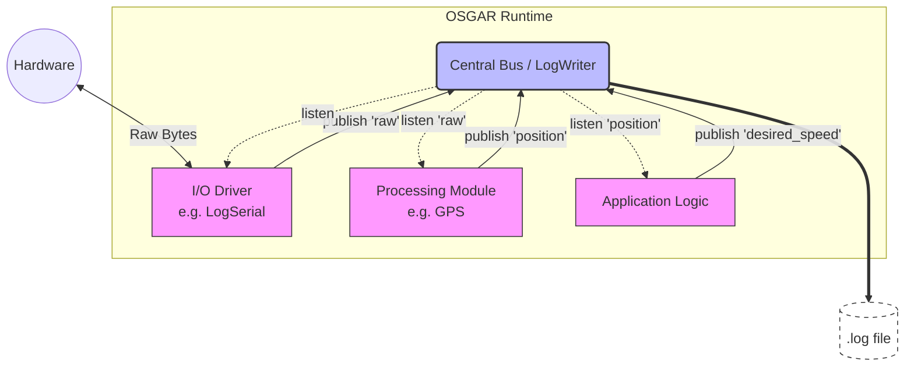

# Deep Dive for OSGAR Developers

This document explains the internal workings of the OSGAR system, specifically focusing on how modules are initialized, how they communicate, and how data is recorded.

## Architecture Overview

OSGAR uses a log-centric, hub-and-spoke architecture where all communication passes through a central Bus and is immediately recorded.



This architecture ensures that the state of the entire system is captured in the log file, enabling perfect replay and deterministic simulation.

## 1. System Starting Modules (`osgar.record`)

The entry point for recording data in OSGAR is `osgar.record`. When you run `python -m osgar.record config.json`, the following sequence occurs:

1.  **Configuration Loading**: The system loads the JSON configuration file using `osgar.lib.config.config_load`. This merges any included configurations and handles parameter overrides.
2.  **LogWriter Initialization**: A `LogWriter` is created to handle the output log file. The entire configuration is serialized and written as the first record (stream 0) in the log.
3.  **Recorder Creation**: The `Recorder` class is instantiated with the configuration and the logger.
4.  **Bus and Handlers**: The `Recorder` creates a central `Bus` object. For each module defined in the configuration, a `_BusHandler` is created. This handler is the module's interface to the rest of the system.
5.  **Module Instantiation**: For each module, the driver class is located (using `get_class_by_name`) and instantiated. The module is passed its specific `init` configuration and its dedicated `bus` handle.
6.  **Connecting Modules**: After all modules are created, the `Bus.connect` method is called for each link in the configuration to establish communication paths.
7.  **Starting Threads**: Finally, `module.start()` is called for each module, which, for `Node`-based modules, starts a new Python thread.

## 2. Module Parameters in Config JSON

The configuration file defines the structure of the OSGAR application. Each module entry typically contains:

-   `driver`: The Python class name or alias (e.g., `osgar.drivers.gps:GPS`).
-   `init`: A dictionary of parameters passed to the module's `__init__` method.
-   `in`: (Optional) List of input channel names.
-   `out`: (Optional) List of output channel names.

**Note on `in` and `out`**: While these keys are present in many OSGAR configurations, they are primarily used for documentation and by visualizers to represent the module's I/O interface. The actual communication paths are defined in the `links` section.

Example:
```json
"modules": {
  "serial": {
    "driver": "osgar.drivers.logserial:LogSerial",
    "init": {
      "port": "/dev/ttyUSB0",
      "speed": 4800
    }
  },
  "gps": {
    "driver": "osgar.drivers.gps:GPS",
    "init": {}
  }
},
"links": [
  ["serial.raw", "gps.raw"],
  ["gps.position", "app.position"]
]
```
In this typical setup, the `serial` module handles the physical communication (opening the port, reading/writing bytes), while the `gps` module listens to the `raw` data stream from `serial` and parses it into high-level coordinates.

## 3. Python Threads and Communication

OSGAR's standard implementation uses Python's `threading.Thread`. Each module runs in its own thread, allowing for concurrent execution.

-   **Standard Version**: Modules inherit from `osgar.node.Node`, which is a `threading.Thread`. They spend most of their time in a `listen()` loop, waiting for data on their input queue.
-   **ZMQ Option**: While threads are the default, OSGAR also supports an alternative architecture using processes and communication via a **ZMQ router** (`osgar/zmqrouter.py`). This is useful for multi-language support or better process isolation, but the core principles of the bus remain the same.

### Mandatory Stream Registration
Every module MUST register its output channels in its `__init__` method using `self.bus.register()`.
```python
def __init__(self, config, bus):
    super().__init__(config, bus)
    bus.register('raw', 'status')
```
Failure to register a stream will result in an error when attempting to `publish()` to it, as the `LogWriter` needs to assign a unique stream ID for the log file at startup.

## 4. Time Handling in OSGAR

A critical rule in OSGAR is: **Never use system time (`time.time()`, `datetime.now()`) inside a module.**

### Why Not System Time?
1.  **Replayability**: OSGAR is designed so that a log file can be replayed exactly as it happened. If a module uses system time, the replay will use the "current" time during replay, breaking deterministic behavior.
2.  **Simulation**: When running in a simulator, time might run faster or slower than real-time. Modules must stay synchronized with the simulator's clock.

### Using the Bus Time
Modules receive a timestamp with every message they `listen()` to. This timestamp should be stored in `self.time` and used for all time-based logic (e.g., timeouts, integration).
```python
def update(self):
    timestamp, channel, data = self.bus.listen()
    self.time = timestamp  # Update internal clock
```

### Simulation and Replay Mode
The "no system time" rule is what makes OSGAR powerful for both simulation and debugging:
-   **In Replay**: `LogReader` reads the original timestamps from the log file. When a module calls `listen()`, it receives the exact same `timedelta` that was recorded during the real run. The module "thinks" it is running in real-time, even if the replay is running much faster.
-   **In Simulation**: A simulator driver (e.g., `subt/simulation.py`) can publish a dedicated `sim_time_sec` channel. Other modules then synchronize their internal state to this published simulation time rather than the wall clock. This allows the simulation to run at any speed (or even pause) without affecting the robot's control logic.

### Estimating Delay
There are two ways to monitor delay in OSGAR:
1.  **Module Processing Delay**: The `publish(channel, data)` function returns the timestamp assigned to the message by the logger. By comparing this returned timestamp with `self.time` (the timestamp of the triggering input message), a module can measure its own internal processing time.
    ```python
    def on_scan(self, data):
        # ... heavy computation ...
        publish_time = self.publish('processed_data', result)
        delay = publish_time - self.time
    ```
2.  **Bus Queue Delay**: The `_BusHandler` internally tracks `max_delay`, which is the difference between the timestamp of data being published and the timestamp of the last data received by that module's `listen()` loop. A large delay here indicates that the module's input queue is backing up because it cannot process incoming messages fast enough.

## 5. Serialization with Msgpack

OSGAR uses `msgpack` for efficient binary serialization of messages.

-   **Msgpack Extension**: OSGAR extends msgpack to support `numpy` arrays and transparent `zlib` compression for large data packets (like camera frames or lidar scans).
-   **Lists vs. Tuples**: In Python, `list` and `tuple` are distinct types. However, `msgpack` serializes both into the same "array" structure. To avoid ambiguity and ensure consistency during replay, the convention in OSGAR is to **always use lists** for message payloads.

## 6. External I/O Nodes (Hardware Interfacing)

Nodes that interact with the real world (via Serial, Ethernet, CAN, etc.) are special because they often need to bridge the synchronous world of OSGAR with the asynchronous nature of hardware I/O.

### The Two-Thread Pattern
While standard `Node`s have one thread for the `listen()`/`update()` loop, complex I/O drivers like `LogSerial` or `LogSocket` often use **two threads**:

1.  **Input Thread**: Constantly reads from the hardware (e.g., `com.read()`) and publishes `raw` data to the OSGAR bus as soon as it arrives.
2.  **Output Thread**: Listens to the OSGAR bus for outgoing commands and writes them to the hardware (e.g., `com.write()`).

This separation ensures that receiving data from a sensor is not blocked by waiting for a command to be published, and vice-versa.

## 7. Module Linking and I/O Names

Links in the configuration define how data flows between modules:

```json
"links": [
  ["gps.position", "app.position"],
  ["app.desired_speed", "base.speed"]
]
```

-   The first part (e.g., `gps.position`) is `sender.output_channel`.
-   The second part (e.g., `app.position`) is `receiver.input_channel`.
-   When a module calls `self.publish('position', data)`, the `_BusHandler` identifies all connected receivers and puts the data into their respective input queues.

## 8. Storage in the Logfile

Everything that passes through the bus is recorded in the logfile via `LogWriter`.

-   **Stream Registration**: Each output channel (e.g., `gps.position`) is registered as a unique "stream" with an ID.
-   **Record Format**: Each log entry consists of:
    -   `stream_id`: Identifying the source.
    -   `timestamp`: The time the data was published.
    -   `data`: Serialized (and optionally compressed) payload.
-   **Replayability**: Because the configuration and all bus messages are logged, the exact state and behavior of the system can be reproduced by "replaying" the log.

## 9. Input Queue Implementation

Each module's `_BusHandler` contains a `queue.Queue()` (a thread-safe FIFO queue).

1.  **Publishing**: When `publish(channel, data)` is called:
    -   The data is serialized and written to the log.
    -   The data (wrapped with its timestamp and target input channel name) is `put()` into the `queue` of every connected module.
2.  **Listening**: When a module calls `listen()` (or `update()`):
    -   It calls `self.queue.get()`, which blocks until data is available.
    -   The module then processes the message, typically by calling a handler method (e.g., `on_position`).

This architecture ensures that modules are decoupled and that data is processed in the order it was received, with the system log serving as a perfect record of all interactions.
